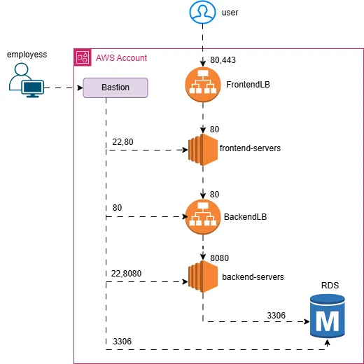

# AWS Architecture with Bastion, Load Balancers, EC2, and RDS

## 📊 Architecture Diagram

# 🔒 AWS Infrastructure Security Group Overview

This document describes the AWS infrastructure architecture and how security groups are configured to manage access between various components.

---

## 📶 Flow of Application Traffic

### 1. User Access
When a user hits the application, the first request goes to the **Frontend Load Balancer (FrontendLB)**.

- **FrontendLB** is internet-facing, so it must allow:
  - Port **80** (HTTP) or
  - Port **443** (HTTPS)

---

### 2. Frontend Load Balancer → Frontend Servers
**FrontendLB** forwards the request to frontend EC2 instances (**frontend-servers**).

**Security Group Rules**:
- Allow **only port 80** from the load balancer.
- No other ports should be allowed to the frontend servers.

---

### 3. Frontend Servers → Backend Load Balancer
**Frontend servers** send traffic to the **Backend Load Balancer (BackendLB)**.

- Even though backend servers listen on **port 8080**, to keep URLs clean (e.g., `backend-dev.aws.online` instead of `backend-dev.aws.online:8080`), configure the **listener on BackendLB** to use **port 80**.
- **BackendLB** is **internal-facing (private)**, not exposed to the internet.

---

### 4. Backend Load Balancer → Backend Servers
**BackendLB** forwards requests to backend EC2 instances (**backend-servers**).

**Security Group Rules**:
- Allow **traffic on port 8080 only** from BackendLB.

---

### 5. Backend Servers → RDS (MySQL Database)
**Backend servers** connect to the **RDS instance** over **port 3306**.

- The **RDS instance** only accepts traffic from backend servers.
- Note: RDS is managed by AWS and does not have a user-configurable load balancer.
  - Access is done via the **RDS endpoint** (e.g., `rds-instance.abcdef12345.us-west-2.rds.amazonaws.com`).

---

## 👨‍💻 Bastion Host Access

Since all servers are in **private subnets**, internal access is managed via a **Bastion Host (jump box)** for employee use.

### 🔐 Bastion Access Matrix

| Source     | Destination        | Ports | Purpose                        |
|------------|--------------------|-------|--------------------------------|
| Employee   | Bastion             | 22    | SSH access to Bastion          |
| Bastion    | Frontend Servers    | 22    | SSH login for troubleshooting  |
| Bastion    | Frontend Servers    | 80    | Check if the app is running    |
| Bastion    | BackendLB           | 80    | BackendLB does not allow SSH   |
| Bastion    | Backend Servers     | 22    | SSH login                      |
| Bastion    | Backend Servers     | 8080  | Application verification       |
| Bastion    | RDS (MySQL)         | 3306  | MySQL database access (debug)  |

---

## 🛡️ Load Balancer Types

### Frontend Load Balancer:
- **Type**: Internet-facing
- **Purpose**: Accepts traffic from external users

### Backend Load Balancer:
- **Type**: Internal (private)
- **Purpose**: Accepts traffic only from frontend servers

---

⚠️ **Note**: All communication is protected and controlled using **AWS Security Groups**. Only required ports are allowed between components to maintain a secure architecture.

---

